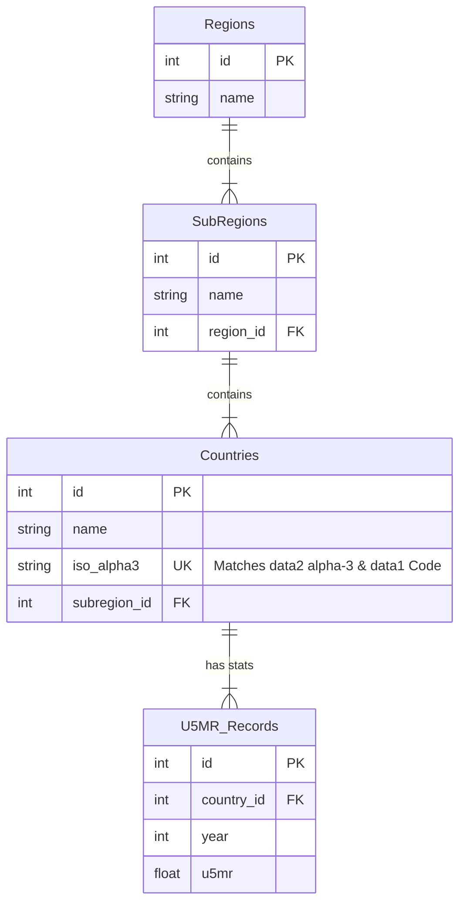

# Final Exam Project

## Database Design (ER Diagram)

```mermaid
erDiagram
    Regions {
        int id PK
        string name
    }

    SubRegions {
        int id PK
        string name
        int region_id FK
    }

    Countries {
        int id PK
        string name
        string iso_alpha3 UK "Matches data2 alpha-3 & data1 Code"
        int subregion_id FK
    }

    U5MR_Records {
        int id PK
        int country_id FK
        int year
        float u5mr
    }

    Regions ||--|{ SubRegions : "contains"
    SubRegions ||--|{ Countries : "contains"
    Countries ||--|{ U5MR_Records : "has stats"
```
